# Users, Monsters and CIA

Sistema para cadastrar usuários e seus monstros

## Rotas

### POST /

Endpoit que verifica se o sistema está no ar.

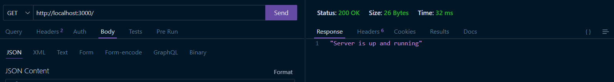

### POST /signup

Cadastra novo usuário por meio de um email que deve ser único [no banco de dados] e uma senha que será encriptada antes de ser registrada no banco de dados.

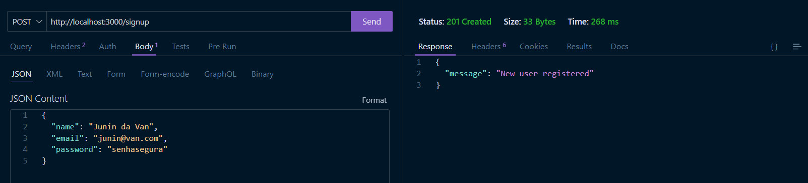
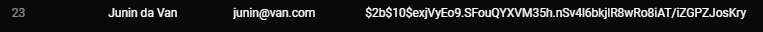

### POST /signin

Loga o usuário por meio do email e senha cadastrados. A sessão é validada por meio de token que expira em 8 horas.
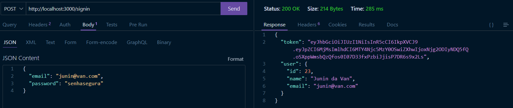

### POST /monster

Cadastra um monstro, vinculado ao usuário, com os dados: name, skills, image e nickname, no qual apenas name e skills são obrigatórios.
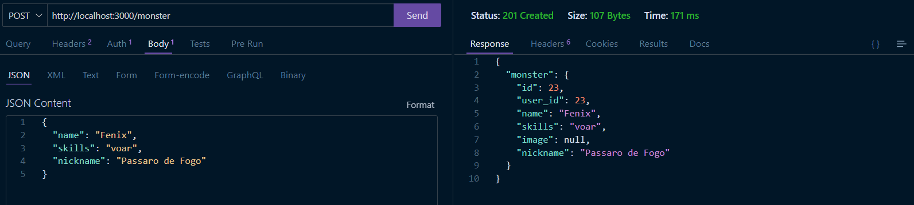

Token recebido ao realizar login:
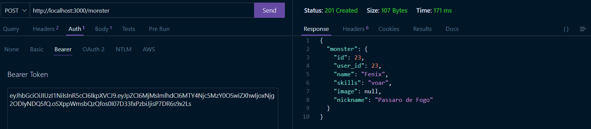

### GET /monsters/id

Recupera o monstro do usuário especificado pelo id da rota ou, quando esse não é especificado(endpoint "/monsters"), recupera todos os monstros cadastrados pelo usuário.

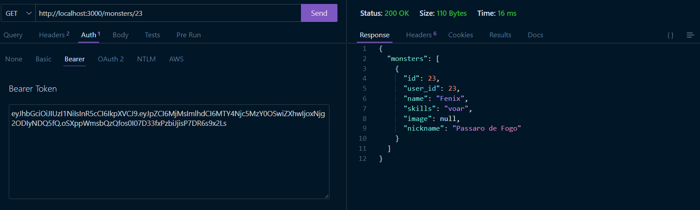
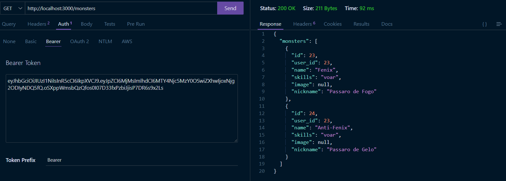

### PATCH /monster/id/"campo"

Modifica o monstro de id selecionado de acordo com o campo escolhido, sendo válidos apenas os campos: name, skills, image, nickname.
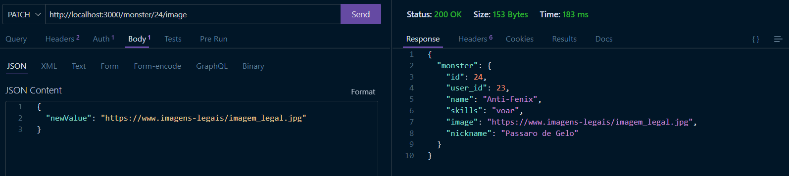
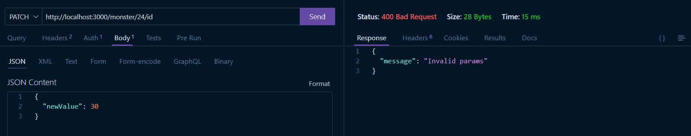

### DELETE /monsters/id

Apaga do banco de dados o monstro com o id especificado vinculado ao usuário.
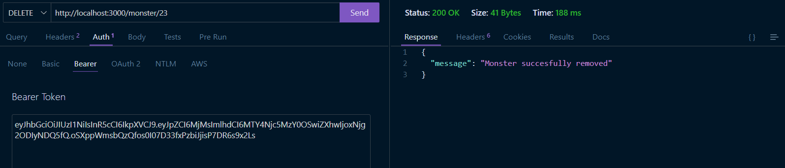

## Principais tecnologias utilizadas

node;

express;

jwt para autenticação;

bcrypt para criptografia de senha;

pg e knex para interagir com o banco de dados.
